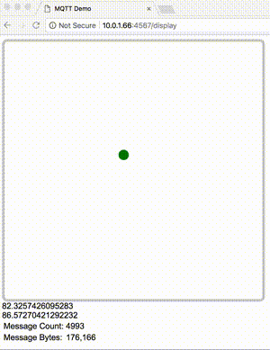

# MQTT Ball Demo

Use a device with device orientation support (e.g. a smart phone with modern browser) to roll a ball around the screen. The coordinates are then relayed via MQTT (websockets) to an MQTT broker. A second browser on another device (e.g. desktop browser) can be used to view the position of the ball as it is moved by the first device.



# Requirements

Install an MQTT broker, like Mosquitto, that supports websocket connections. On some systems you may need to compile Mosquitto with websockets support explicitly. I installed Mosquitto on a Macbook with homebrew.

A smartphone with a browser that supports device orientation events is the best for sending the data. I used an iPhone.

# Running

You'll need to run the Mosquitto server and the Sinatra server. 

A basic `mosquitto.conf` file is provided:

```
# Config file for mosquitto
# See mosquitto.conf(5) for more information.

# Port to use for the default listener.
port 1883
protocol mqtt

# =================================================================
# Extra listeners
# =================================================================
listener 8083 192.168.254.55 # Change this IP
protocol websockets
```

Change the IP address in the listener directive to that of the host you run the broker on. Start it with something like:

```
$ /usr/local/sbin/mosquitto -c mosquitto.conf
```

If you run the broker on your computer you will need to allow connections on port 8083.

Run the Sinatra web server on a host your phone can reach. You will need to allow incoming connections on port 4567.

```
$ ruby server.rb <mqtt_host_ip>
== Sinatra (v2.0.3) has taken the stage on 4567 for development with backup from Thin
Thin web server (v1.7.2 codename Bachmanity)
Maximum connections set to 1024
Listening on 0.0.0.0:4567, CTRL+C to stop
```

# Using

Browse to the root URL of the Sinatra web server on your phone, e.g.

`http://<ip_address_of_web_server>:4567/`

On another host (e.g. your laptop) browse to the "display" URL, e.g.

`https://<ip_address_of_web_server>:4567/display`

If the MQTT broker is reachable from both of the above, you can start wiggling your phone and seeing the ball move on both your phone screen and the "display" browser.

